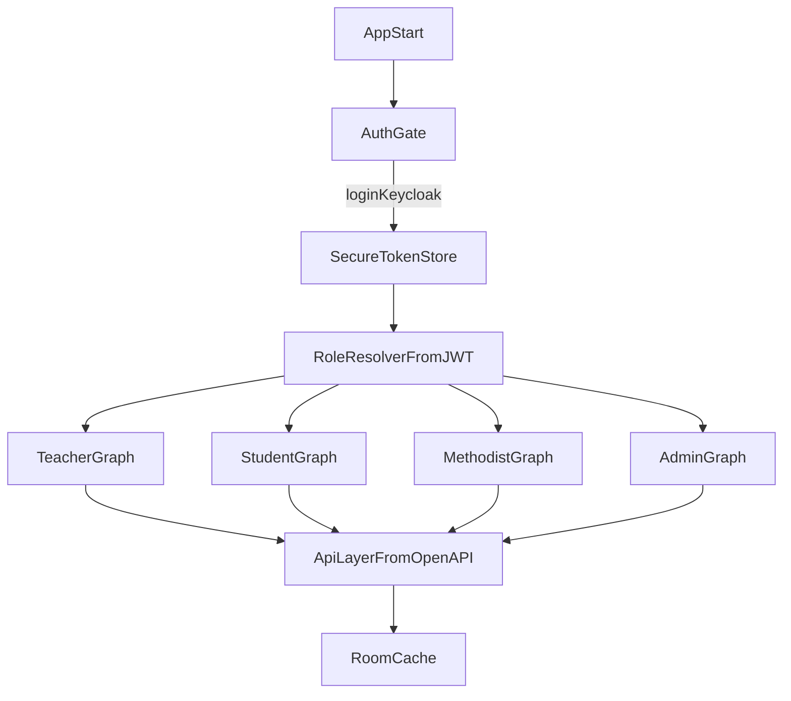

<!--firebender-plan
name: Android Journal App Plan
overview: План разработки Android-приложения электронного журнала на Kotlin + Compose с MVVM+FSD, поэтапным запуском ролей (преподаватель → студент → методист → администратор) и реализацией переданных teacher Figma-шаблонов на основе OpenAPI-контрактов.
todos:
  - id: bootstrap-foundation
    content: "Создать новый Android-проект на Kotlin + Compose с MVVM + FSD архитектурой и строгими правилами модульных зависимостей."
  - id: implement-auth-keycloak
    content: "Реализовать авторизацию через Keycloak (OIDC PKCE), безопасное хранение токенов и ролевой роутинг после логина."
  - id: integrate-openapi-client
    content: "Настроить слой API по journal.yaml, единый env-конфиг окружений (base URLs, keycloak params, feature flags) и матрицу operationId → use case/экран."
  - id: deliver-teacher-role
    content: "Реализовать все teacher-шаблоны из figma (home, journal, student card, dashboard, ved) с привязкой к API, включая flow расписание -> журнал, и закрыть teacher endpoint’ы тестами."
  - id: deliver-student-role
    content: "Реализовать полный функционал роли студента и закрыть соответствующие endpoint’ы тестами."
  - id: deliver-methodist-role
    content: "Реализовать функционал методиста (КТП/назначения) и покрыть endpoint’ы тестами."
  - id: deliver-admin-role
    content: "Реализовать функционал администратора (импорт студентов и конфликты) и покрыть endpoint’ы тестами."
  - id: quality-hardening
    content: "Провести полную валидацию покрытия всех endpoint’ов, интеграционное тестирование и подготовить релиз."
-->

# План разработки Android Journal App (Kotlin + Compose)

## Цель
Собрать production-ready Android-приложение с полным покрытием API из `journal.yaml`, role-based UX для 4 ролей и безопасной авторизацией через Keycloak (AD).

## Текущий контекст
- В рабочей папке есть OpenAPI-спека: [C:/Users/fmkro/iis.jrnl/androind.client/journal.yaml](C:/Users/fmkro/iis.jrnl/androind.client/journal.yaml).
- Доступен актуальный код Go-бэкенда (Edge + Domain): [C:/Users/fmkro/iis.jrnl/server/university-journal-system-master](C:/Users/fmkro/iis.jrnl/server/university-journal-system-master).
- Получены результаты аудита endpoint’ов и детальный контракт grid read-model: [C:/Users/fmkro/OneDrive/Рабочий стол/API_ENDPOINTS_AUDIT_EXPORT.pdf](C:/Users/fmkro/OneDrive/Рабочий стол/API_ENDPOINTS_AUDIT_EXPORT.pdf), [C:/Users/fmkro/OneDrive/Рабочий стол/journal-grid.pdf](C:/Users/fmkro/OneDrive/Рабочий стол/journal-grid.pdf).
- Получены UI-шаблоны преподавателя: [C:/Users/fmkro/iis.jrnl/androind.client/figma/teacher-home.md](C:/Users/fmkro/iis.jrnl/androind.client/figma/teacher-home.md), [C:/Users/fmkro/iis.jrnl/androind.client/figma/teacher-journal.md](C:/Users/fmkro/iis.jrnl/androind.client/figma/teacher-journal.md), [C:/Users/fmkro/iis.jrnl/androind.client/figma/teacher-journal-student-card.md](C:/Users/fmkro/iis.jrnl/androind.client/figma/teacher-journal-student-card.md), [C:/Users/fmkro/iis.jrnl/androind.client/figma/teacher-dashbs.md](C:/Users/fmkro/iis.jrnl/androind.client/figma/teacher-dashbs.md), [C:/Users/fmkro/iis.jrnl/androind.client/figma/teacher-ved.md](C:/Users/fmkro/iis.jrnl/androind.client/figma/teacher-ved.md), [C:/Users/fmkro/iis.jrnl/androind.client/figma/ui-auth.md](C:/Users/fmkro/iis.jrnl/androind.client/figma/ui-auth.md).
- Код Android-проекта отсутствует — стартуем с нуля.
- Дизайн handoff из Figma частичный, значит нужен отдельный этап нормализации компонентов/состояний.

## Целевая архитектура приложения
- **UI**: Jetpack Compose + Material 3 + дизайн-токены.
- **Архитектурный стиль**: **MVVM + FSD (feature-sliced design)**.
- **FSD-срезы**: `app`, `processes` (опционально), `pages`, `features`, `entities`, `shared`.
- **MVVM в каждом feature/page**: `UiState`, `UiEvent/Intent`, `ViewModel`, `UseCase`.
- **Слой данных**: `repository` + `remote/local` + мапперы DTO↔domain.
- **Networking**: Retrofit + OkHttp + Kotlinx Serialization (или Moshi) + OpenAPI-generated DTO/clients.
- **Конфигурация окружений**: единый `env`/`gradle properties` слой (test/prod), без хардкода URL, realm/client id и служебных флагов в коде.
- **DI**: Hilt.
- **State**: ViewModel + `StateFlow` + UDF/MVI-подобный подход.
- **Navigation**: role-aware graph (отдельные потоки по ролям после логина).
- **Auth**: OAuth2/OIDC с Keycloak (Authorization Code + PKCE), secure token storage, auto refresh.
- **Offline/Cache**: Room + sync strategy для справочников и последних экранов.
- **Правила зависимостей**: только вниз по слоям FSD (например, `features -> entities/shared`, без циклов и без прямых зависимостей между несвязанными feature).

## Поэтапный roadmap (по ролям)

### Этап 0: Foundation
- Создать Android-проект и базовую инфраструктуру модулей по FSD (`app/pages/features/entities/shared`).
- Зафиксировать MVVM-шаблон для feature-модулей (контракты `UiState/UiEvent/ViewModel/UseCase`).
- Подключить Keycloak auth flow, token lifecycle, logout.
- Настроить единый конфиг окружений (`env`/`local.properties`/`BuildConfig`) для base URL Edge, OpenAPI URL, Keycloak realm/client id, debug-флагов.
- Поднять базовый дизайн-кит из Figma (цвета, типографика, spacing, базовые компоненты).
- Сгенерировать API-контракты из OpenAPI и собрать слой `ApiService`.

### Этап 1: Преподаватель (первый релиз по переданным макетам)
- Реализовать auth UI (`figma/ui-auth.md`) и debug-auth flow через `X-Debug-Role` для тестовой среды.
- Реализовать главный teacher-экран расписания (`figma/teacher-home.md`) на данных `GET /api/v1/lessons`.
- Реализовать переход по tap на занятие в teacher journal screen (`figma/teacher-journal.md`) на базе `GET /api/v1/groups/{group_id}/journal` (context: `discipline_id` + `academic_period_id`).
- Реализовать запись из журнала через attendance/grades endpoints (mark/bulk/create/update/archive/restore) и состояния редактирования.
- Реализовать teacher dashboard (`figma/teacher-dashbs.md`) только в части, которая поддержана текущими API; неподдержанные виджеты и действия временно исключить из scope.
- Реализовать teacher-ведомости (`figma/teacher-ved.md`) только для поддержанных API-сценариев; функции на базе `/reports/*` временно исключить из scope.
- Реализовать teacher student-card (`figma/teacher-journal-student-card.md`) только в части, обеспеченной текущими endpoint’ами; недостающие teacher-specific данные вынести в backlog.
- Заложить mobile-оптимизации для тяжёлой read model (lazy rendering, кеш последнего grid response, фоновый refresh).
- Интеграционные тесты критического teacher user journey (login -> schedule -> lesson tap -> journal -> edit -> student card/dashboard/ved).

### Этап 2: Студент
- Профиль, мои занятия, мои предметы, карточка предмета.
- Корректное read-only поведение и фильтрация данных по студенту.
- UI/UX выравнивание с teacher-блоком и дизайн-системой.

### Этап 3: Методист
- КТП-шаблоны: CRUD, темы, reorder, назначения.
- Проверка ролевых прав methodist/admin на соответствующих действиях.

### Этап 4: Администратор
- Импорт студентов (submit/preview/conflicts/resolve/apply/cancel).
- Инструменты мониторинга статусов batch и обработка конфликтов.

### Этап 5: Полное покрытие и hardening
- Матрица соответствия: `operationId` → экран/действие/тест (с пометкой «реализован в Edge / не реализован в Edge» по данным аудита).
- Контрактные и e2e-тесты для всех доступных endpoint’ов в текущем scope; не реализованные сейчас (`/reports/*`, `/teacher/stats`, `/teacher/attendance-summary`, `/teacher/groups-performance`, отдельный teacher student-card endpoint) — вынести в backlog следующего этапа.
- Учет дефектов из аудита в клиентской обработке ошибок (где возможны нестабильные 4xx/5xx, edge-case пустые массивы вместо 404, и debug-специфика с `DEBUG_BYPASS_AUTH=true`).
- Производительность, crash-free метрики, аналитика, релизная сборка.

## Ключевые файлы/папки для реализации
- [C:/Users/fmkro/iis.jrnl/androind.client/journal.yaml](C:/Users/fmkro/iis.jrnl/androind.client/journal.yaml) — источник API-контрактов.
- [C:/Users/fmkro/iis.jrnl/androind.client/app/src/main/java/.../auth](C:/Users/fmkro/iis.jrnl/androind.client/app/src/main/java/.../auth) — Keycloak/OIDC.
- [C:/Users/fmkro/iis.jrnl/androind.client/app/src/main/java/.../data/remote](C:/Users/fmkro/iis.jrnl/androind.client/app/src/main/java/.../data/remote) — API-клиенты.
- [C:/Users/fmkro/iis.jrnl/androind.client/figma/teacher-home.md](C:/Users/fmkro/iis.jrnl/androind.client/figma/teacher-home.md), [C:/Users/fmkro/iis.jrnl/androind.client/figma/teacher-journal.md](C:/Users/fmkro/iis.jrnl/androind.client/figma/teacher-journal.md), [C:/Users/fmkro/iis.jrnl/androind.client/figma/teacher-journal-student-card.md](C:/Users/fmkro/iis.jrnl/androind.client/figma/teacher-journal-student-card.md), [C:/Users/fmkro/iis.jrnl/androind.client/figma/teacher-dashbs.md](C:/Users/fmkro/iis.jrnl/androind.client/figma/teacher-dashbs.md), [C:/Users/fmkro/iis.jrnl/androind.client/figma/teacher-ved.md](C:/Users/fmkro/iis.jrnl/androind.client/figma/teacher-ved.md), [C:/Users/fmkro/iis.jrnl/androind.client/figma/ui-auth.md](C:/Users/fmkro/iis.jrnl/androind.client/figma/ui-auth.md) — источник UI для teacher-сценариев.
- [C:/Users/fmkro/iis.jrnl/androind.client/app/src/main/java/.../feature/teacher](C:/Users/fmkro/iis.jrnl/androind.client/app/src/main/java/.../feature/teacher) — teacher фичи.
- [C:/Users/fmkro/iis.jrnl/androind.client/app/src/main/java/.../feature/student](C:/Users/fmkro/iis.jrnl/androind.client/app/src/main/java/.../feature/student) — student фичи.
- [C:/Users/fmkro/iis.jrnl/androind.client/app/src/main/java/.../feature/methodist](C:/Users/fmkro/iis.jrnl/androind.client/app/src/main/java/.../feature/methodist) — methodist фичи.
- [C:/Users/fmkro/iis.jrnl/androind.client/app/src/main/java/.../feature/admin](C:/Users/fmkro/iis.jrnl/androind.client/app/src/main/java/.../feature/admin) — admin фичи.
- [C:/Users/fmkro/iis.jrnl/androind.client/app/src/test](C:/Users/fmkro/iis.jrnl/androind.client/app/src/test) и [C:/Users/fmkro/iis.jrnl/androind.client/app/src/androidTest](C:/Users/fmkro/iis.jrnl/androind.client/app/src/androidTest) — тестовое покрытие.

## Definition of Done
- Для роли teacher реализован сценарий `расписание -> журнал`: список занятий из `GET /api/v1/lessons` и переход по занятию в `GET /api/v1/groups/{group_id}/journal`, плюс корректные write-сценарии через отдельные endpoints.
- Каждый endpoint из текущего согласованного scope имеет минимум один клиентский сценарий (экран/действие/фоновая операция).
- Неподдержанные API-сценарии (reports/dashboard teacher APIs и отдельная teacher student-card детализация) документированы и вынесены в backlog следующей итерации.
- Все 4 роли имеют законченные навигационные потоки и корректные ограничения прав.
- Авторизация/обновление токенов/выход работают стабильно.
- Для критических user journey есть автоматические тесты.
- Дизайн соответствует Figma в основных и edge-состояниях.
