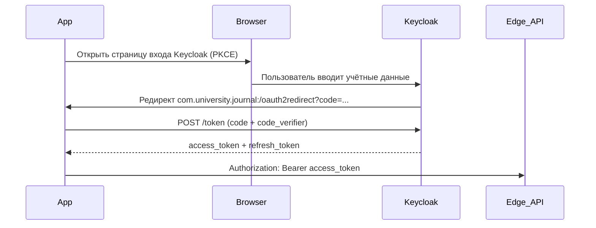

<!--firebender-plan
name: Keycloak OAuth Auth
overview: Реализовать реальный OAuth2 Authorization Code + PKCE через Keycloak с библиотекой AppAuth-Android: открывает страницу входа в браузере, обменивает code на access token, извлекает роль из JWT и переходит на нужный экран.
todos:
  - id: add-deps
    content: "Добавить net.openid:appauth:0.11.1 в app/build.gradle.kts и features/auth/build.gradle.kts"
  - id: manifest
    content: "Добавить RedirectUriReceiverActivity + intent-filter для com.university.journal:/oauth2redirect в AndroidManifest.xml"
  - id: token-session
    content: "Создать TokenSession.kt в core/common с MutableStateFlow<String?> для хранения access token"
  - id: bearer-interceptor
    content: "Создать BearerTokenInterceptor.kt в core/network/interceptor"
  - id: app-module
    content: "Обновить AppModule.kt: добавить TokenSession как Singleton и подключить BearerTokenInterceptor в OkHttpClient"
  - id: auth-viewmodel
    content: "Создать AuthViewModel.kt в features/auth с методами buildAuthIntent() и handleAuthResponse() для извлечения роли из JWT"
  - id: auth-route
    content: "Переработать AuthRoute.kt: сохранить debug-режим при useDebugRole=true, добавить OAuth через браузер при useDebugRole=false"
-->

# Авторизация через Keycloak — Authorization Code + PKCE

## Схема потока

## Keycloak клиент (из скриншота)
- **Client ID**: `journal-mobile` (уже указан в `env.test.properties`)
- **Redirect URI**: `com.university.journal:/oauth2redirect`
- **Public client** (секрет не нужен)

## Библиотека
Добавить **AppAuth-Android** (`net.openid:appauth:0.11.1`) — стандартная библиотека для OAuth2/OIDC на Android, автоматически обрабатывает PKCE.

## Новые файлы

- **`core/common/.../auth/TokenSession.kt`** — `MutableStateFlow<String?>` для хранения access token; методы `setToken()` и `clear()`
- **`core/network/.../interceptor/BearerTokenInterceptor.kt`** — OkHttp `Interceptor`, добавляет заголовок `Authorization: Bearer <token>` из `TokenSession`
- **`features/auth/.../AuthViewModel.kt`** — `@HiltViewModel`, который:
  - Строит `AuthorizationRequest` из `AppConfig` (URL Keycloak + client ID)
  - Возвращает AppAuth `Intent` для открытия в браузере
  - После callback: обменивает `code` на токены через `AuthorizationService.performTokenRequest()`
  - Декодирует JWT payload (base64url) и извлекает `resource_access.journal-backend.roles[0]`
  - Сохраняет токен в `TokenSession`, роль в `RoleSession`

## Изменяемые файлы

- **`app/build.gradle.kts`** — добавить `implementation("net.openid:appauth:0.11.1")`
- **`features/auth/build.gradle.kts`** — добавить ту же зависимость AppAuth
- **`app/src/main/AndroidManifest.xml`** — добавить `net.openid.appauth.RedirectUriReceiverActivity` с intent-filter:
  - `android:scheme="com.university.journal"`, path `/oauth2redirect`
- **`app/src/main/java/.../di/AppModule.kt`** — добавить `TokenSession` как `@Singleton`; подключить `BearerTokenInterceptor` в `OkHttpClient` (только при `useDebugRole = false`)
- **`features/auth/.../AuthRoute.kt`** — переработать:
  - **`useDebugRole=true`**: оставить текущий debug UI с чипами ролей без изменений
  - **`useDebugRole=false`**: показать логотип + кнопку «В��йти»; по клику `rememberLauncherForActivityResult` запускает AppAuth intent в браузере; по возврату вызвать `viewModel.handleAuthResponse()` → `onContinue(role)`

## Навигация (изменения не нужны)
`JournalNavHost` уже маршрутизирует по результату `onContinue(role)` — модифицировать не нужно.

## Условный режим debug / реальная авторизация
- `USE_DEBUG_ROLE=false` в `env.test.properties` → реальный OAuth через браузер Keycloak
- `USE_DEBUG_ROLE=true` → старый debug-режим с чипами ролей (Keycloak не нужен)
