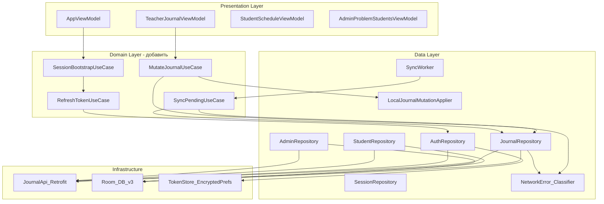

<!--firebender-plan
name: Offline Architecture Audit
overview: Полный аудит кодовой базы + детальный план реализации всех этапов offline-first без MVP-ограничения: Clean Architecture, MVVM, FSD, конкретные классы/методы/миграции/тесты.
todos:
  - id: stage0-auth-repo
    content: "✅ AuthRepository создан: tryRefresh(), extractRole() вынесены из AppViewModel, refresh errors классифицируются"
  - id: stage0-network-error
    content: "✅ NetworkError создан: NetworkUnavailable, ServerError, AuthError, ValidationError, ConflictError, Unknown"
  - id: stage0-ssl-fix
    content: "✅ trustAllSslContext / unsafe SSL bypass удален из проекта"
  - id: stage0-student-viewmodels
    content: "✅ StudentScheduleViewModel и StudentJournalViewModel созданы и подключены"
  - id: stage0-admin-repos
    content: "⚠️ MethodistDashboard и AdminDashboard переведены на repository/cache; TeacherStudentCard и TeacherVed переведены на repositories; остальные admin/methodist secondary repositories еще нужны"
  - id: stage1-session-entity
    content: "✅ SessionEntity расширен: userId, fullName, lastOnlineAt, offlineAllowedUntil"
  - id: stage1-offline-state
    content: "✅ SessionState.OfflineAuthenticated добавлен, refresh ошибки различаются через AuthRepository/NetworkError"
  - id: stage1-auth-save-session
    content: "✅ AuthViewModel сохраняет Room-сессию после успешного Keycloak-логина"
  - id: stage1-debug-login-session
    content: "✅ Debug-login удален из проекта; повторно не реализовывать, тестирование идет через Keycloak"
  - id: stage2-pending-entity-ext
    content: "✅ PendingActionEntity расширен: status, localId, serverId, nextAttemptAt, entityType, actionKey"
  - id: stage2-room-migration
    content: "✅ Room migrations реализованы до JournalDatabase v6: session, pending_actions, student caches, dashboard_cache"
  - id: stage2-local-mutator
    content: "✅ LocalJournalMutationApplier создан и применяет offline mutations к JournalGridResponse"
  - id: stage2-atomic-write
    content: "✅ JournalRepository write-методы используют атомарный applyAndEnqueue(): coalescing + pending + cache update"
  - id: stage2-coalescing
    content: "✅ PendingActionDao.deleteConflicting() удаляет старые записи по actionKey"
  - id: stage2-error-classification
    content: "✅ JournalRepository использует NetworkError classifier: network/server -> queue, validation/conflict/auth -> throw"
  - id: stage2-pending-ui
    content: "✅ TeacherJournal UI показывает pending indicators, offline banner и pending count"
  - id: stage3-sync-worker-rewrite
    content: "✅ SyncWorker переработан: SYNCING/FAILED/CONFLICT, retry с nextAttemptAt, cache invalidation"
  - id: stage3-delete-grade
    content: "⚠️ DELETE_GRADE локально применяется, но серверный sync не реализован из-за отсутствия endpoint"
  - id: stage3-enqueue-on-insert
    content: "✅ JournalRepository enqueue sync после pending insert через PendingSyncScheduler"
  - id: stage3-sync-cache-refresh
    content: "⚠️ SyncWorker после успеха удаляет pending и инвалидирует journal cache; явный re-fetch еще не сделан"
  - id: stage3-conflict-ui
    content: "❌ UI для conflict/failed actions еще не создан: нужны детали, Retry / Discard"
  - id: stage4-student-schedule-repo
    content: "✅ StudentScheduleRoute подключен к StudentRepository через StudentScheduleViewModel"
  - id: stage4-student-journal-cache
    content: "✅ student_subject_card_cache добавлен: StudentRepository.getSubjectCard() через networkBoundResource"
  - id: stage4-student-profile-cache
    content: "✅ student_profile_cache добавлен: StudentRepository.getDashboard() через networkBoundResource"
  - id: stage4-student-offline-ui
    content: "✅ Student экраны показывают cached/offline states"
  - id: stage5-teacher-dashboard-cache
    content: "✅ TeacherDashboardRoute использует dashboard_cache для стартового JSON snapshot, выбранного журнала и списка учителей access dialog; access grant остается online-only"
  - id: stage5-methodist-read-cache
    content: "⚠️ MethodistDashboard и MethodistJournals кешируются; осталось templates/journalcreate read-cache и online-only markers"
  - id: stage5-admin-read-cache
    content: "✅ AdminDashboard, AdminUsers, AdminAudit, AdminJournals, AdminPeriods, AdminAccess и AdminProblemStudents read-cache готовы через AdminRepository/ViewModels"
  - id: stage5-dashboard-cache-table
    content: "✅ dashboard_cache таблица добавлена в Room"
  - id: stage6-online-only-markers
    content: "❌ Нужны online-only markers: disabled + сообщение для admin write, methodist write/create/edit, access grant, опасных операций"
  - id: stage6-conflict-resolution
    content: "❌ ConflictResolutionDialog / Pending actions management UI не создан"
  - id: stage6-logout-cleanup
    content: "✅ Logout чистит локальные данные: Room.clearAllTables + TokenStore.clear + TokenSession.clear"
  - id: stage6-session-ttl
    content: "⚠️ offlineAllowedUntil считается и проверяется; SessionExpired state/UI еще не добавлены"
  - id: tests-stage0
    content: "❌ Тесты AuthRepository и NetworkError classifier еще не добавлены"
  - id: tests-stage1
    content: "❌ Тесты AppViewModel offline fallback / OfflineAuthenticated / SessionExpired еще не добавлены"
  - id: tests-stage2
    content: "⚠️ JournalRepository tests, TeacherStudentCardViewModel tests, TeacherVed tests и Admin secondary ViewModel tests есть; LocalJournalMutationApplier/coalescing/error-classification покрытие нужно усилить"
  - id: tests-stage3
    content: "❌ SyncWorker tests еще не добавлены"
  - id: tests-migration
    content: "❌ Room migration tests для цепочки до v6 еще не добавлены"
-->


# Аудит архитектуры + полный план реализации offline-first

---

## СТАТУС ВЫПОЛНЕНИЯ ПЛАНА

> Актуализировано после среза Admin secondary ViewModels/read-cache.
> Проверено по коду: JournalDatabase v6, 5 миграций (1->2, 2->3, 3->4, 4->5, 5->6). Debug-mode удален, тестирование идет через Keycloak.

### Этап 0 — Архитектурные основы

- **AuthRepository** — ✅ создан, `tryRefresh()` и `extractRole()` перенесены из AppViewModel. Использует raw `HttpURLConnection` (не Retrofit) — допустимо для startup-refresh.
- **NetworkError sealed class** — ✅ создан со всеми вариантами: `NetworkUnavailable`, `ServerError`, `AuthError`, `ValidationError`, `ConflictError`, `Unknown`, плюс `toNetworkError()`.
- **trustAllSslContext / unsafe SSL bypass** — ✅ удален из проекта.
- **Debug auth mode / RoleSession / DebugRoleInterceptor** — ✅ удалены из проекта. Пункты про debug-login больше не актуальны.
- **StudentScheduleViewModel** — ✅ создан и подключен в `StudentRoutes.kt`; прямых вызовов `JournalApi` в `features/student` нет.
- **StudentJournalViewModel** — ✅ создан и подключен.
- **TeacherDashboardViewModel** — ✅ создан и подключен к `TeacherDashboardRepository` для стартового snapshot, выбранного журнала и списка учителей access dialog.
- **MethodistDashboardViewModel** — ✅ создан и подключен к `MethodistRepository`.
- **MethodistJournalsViewModel** — ✅ создан. `MethodistJournalsRoute` читает список журналов и справочники фильтров через `MethodistRepository`.
- **MethodistTemplatesViewModel / MethodistJournalCreateViewModel** — ❌ не созданы. `MethodistRoutes.kt`, `MethodistJournalCreateRoute` пока используют `JournalApi` напрямую.
- **AdminDashboardViewModel** — ✅ создан и подключен к `AdminRepository`.
- **AdminUsersViewModel** — ✅ создан. `AdminUsersRoute` читает список пользователей через `AdminRepository`, write-операции остаются online-only через `JournalApi`.
- **AdminAuditViewModel / AdminJournalsViewModel / AdminPeriodsViewModel / AdminAccessViewModel / AdminProblemStudentsViewModel** — ✅ созданы. Secondary admin routes читают списки через `AdminRepository` read-cache; write/export/revoke операции остаются online-only через `JournalApi`.
- **TeacherStudentCardViewModel** — ✅ создан. `TeacherStudentCardRoute` читает карточку через `JournalRepository.getJournalGrid()` и показывает cached/offline state.
- **TeacherVedViewModel** — ✅ создан. `TeacherVedRoute` читает каталог периодов/занятий через `TeacherVedRepository`, показывает cached/offline state, а формирование/скачивание ведомостей оставлены online-only.

### Этап 1 — Сессия и offline-вход

- **SessionEntity расширение** — ✅ `userId`, `fullName`, `lastOnlineAt`, `offlineAllowedUntil`, `DEFAULT_OFFLINE_TTL_MS = 30 дней`.
- **SessionRepository.saveSession()** — ✅ принимает `lastOnlineAt`, вычисляет `offlineAllowedUntil`.
- **SessionState.OfflineAuthenticated** — ✅ добавлен в AppViewModel.
- **Offline fallback при refresh** — ✅ AppViewModel различает `NetworkError.NetworkUnavailable/ServerError` (fallback к Room) и `AuthError` (logout).
- **AuthViewModel сохраняет сессию** — ✅ вызывает `sessionRepository.saveSession()` после успешного Keycloak-логина.
- **SessionState.SessionExpired** — ❌ не добавлен. `isOfflineAllowed()` проверяется, но UI не получает отдельный статус истекшей offline-сессии.
- **Debug-login session** — снято с плана: debug-login удален.

### Этап 2 — Teacher Journal offline write

- **PendingActionEntity расширение** — ✅ `status`, `localId`, `serverId`, `nextAttemptAt`, `entityType`, `actionKey` добавлены.
- **PendingActionStatus** — ✅ есть как `object` с константами (`PENDING`, `SYNCING`, `FAILED`, `CONFLICT`).
- **Room migrations** — ✅ реализованы отдельными миграциями, база версии 6.
- **LocalJournalMutationApplier** — ✅ создан, реализованы операции для attendance, grades, assessment forms, lesson topic, включая локальный `DELETE_GRADE`.
- **JournalRepository.applyAndEnqueue()** — ✅ атомарная транзакция `db.withTransaction`: coalescing + insert pending + update cache.
- **PendingActionDao.deleteConflicting()** — ✅ удаляет по `actionKey`.
- **NetworkError classification** — ✅ `enqueueOfflineOrThrow()` корректно: `NetworkUnavailable/ServerError` -> queue; `AuthError/ValidationError/ConflictError` -> throw.
- **UI pending indicators** — ✅ в TeacherJournal есть pending badges на ячейках, offline banner, счётчик ожидающих.

### Этап 3 — SyncWorker

- **SyncWorker переработан** — ✅ статусы SYNCING/FAILED/CONFLICT, retry с `nextAttemptAt` и exponential backoff, инвалидация `journalGridCache` после успеха.
- **Enqueue sync после insert** — ✅ `syncScheduler.enqueue()` вызывается после offline enqueue.
- **DELETE_GRADE** — ⚠️ локальный кеш обновляется, но синк переводит действие в `CONFLICT`, потому что реального server endpoint/API-вызова нет.
- **Conflict UI** — ❌ нет. `ConflictResolutionDialog` не создан, UI для просмотра FAILED/CONFLICT actions отсутствует.

### Этап 4 — Student offline

- **StudentSubjectCardCacheEntity** — ✅ создана (migration 4->5).
- **StudentProfileCacheEntity** — ✅ создана (migration 4->5).
- **StudentRepository.getLessons()** — ✅ offline-first через `networkBoundResource`.
- **StudentRepository.getSubjectCard()** — ✅ offline-first через `student_subject_card_cache`.
- **StudentRepository.getDashboard() / student profile cache** — ✅ offline-first через `student_profile_cache`.
- **StudentScheduleRoute -> StudentScheduleViewModel** — ✅ подключено.
- **StudentJournalRoute -> StudentJournalViewModel** — ✅ подключено.
- **Offline states на student экранах** — ✅ показываются cached data + offline state/error fallback.

### Этап 5 — Read-only offline для Dashboard/Methodist/Admin

- **DashboardCacheEntity** — ✅ создана (migration 5->6).
- **TeacherDashboardRepository** — ✅ создан, `TeacherDashboardRoute` использует кеш для стартового dashboard snapshot, выбранного журнала и списка учителей для access dialog.
- **TeacherStudentCardRoute** — ✅ прямой `JournalApi` убран, маршрут расширен `lessonType`, карточка строится из кешируемого `JournalGrid`.
- **TeacherVedRoute** — ✅ прямой `JournalApi` убран из Route; каталог периодов/групп/дисциплин кешируется через `TeacherVedRepository`, report actions disabled offline.
- **MethodistRepository** — ✅ создан для `MethodistDashboardRoute`.
- **MethodistDashboardRoute** — ✅ убран прямой `JournalApi`, добавлен offline snapshot и banner.
- **AdminRepository** — ✅ создан для `AdminDashboardRoute`.
- **AdminUsersRoute** — ✅ read-cache готов через `AdminRepository.getUsers()`; при offline показаны сохраненные данные и online-only сообщение для редактирования/блокировки.
- **AdminDashboardRoute** — ✅ убран прямой `JournalApi`, добавлен offline snapshot и banner.
- **MethodistJournalsRoute** — ✅ прямой `JournalApi` убран, добавлен `MethodistRepository.getJournals()` с cache snapshot и offline state.
- **MethodistTemplatesRoute / JournalCreate** — ❌ прямой `JournalApi` остается; read-cache и online-only markers еще не сделаны.
- **Admin screens read-cache** — ✅ dashboard, users, audit, journals, periods, access и problem students читают через `AdminRepository`/ViewModels; write/export/revoke операции остаются online-only.
- **TeacherDashboard secondary flows** — ✅ выбранный журнал и список учителей для access dialog читаются через `TeacherDashboardRepository` с cache fallback; сама операция access grant остается online-only и отключается offline.

### Этап 6 — Полировка

- **Online-only маркеры** — ❌ нужны для admin write, methodist write/create/edit, teacher dashboard access grant и bulk/опасных операций.
- **ConflictResolutionDialog / Pending actions management UI** — ❌ не создан.
- **Logout очищает всё** — ✅ `sessionRepository.clearAll()` = `Room.clearAllTables()` + `tokenStore.clear()` + `tokenSession.clear()`.
- **Session TTL UI** — ⚠️ `offlineAllowedUntil` проверяется, но отдельного `SessionExpired` state и понятного UI нет.
- **Пользовательские сообщения на пустом кеше** — ✅ улучшены для части экранов, включая TeacherStudentCard; нужно продолжать при переводе admin/methodist экранов на repositories.

### Тесты

- **Уже есть** — ✅ `NetworkBoundResourceTest`, `SessionRepositoryTest`, `StudentRepositoryTest`, `TeacherRepositoryTest`, `JournalRepositoryTest`, `TeacherDashboardRepositoryTest`, `TeacherVedRepositoryTest`, `MethodistRepositoryTest`, `AdminRepositoryTest`, `TeacherHomeViewModelTest`, `TeacherJournalViewModelTest`, `TeacherStudentCardViewModelTest`, `TeacherVedViewModelTest`, `TeacherDashboardViewModelTest`, `MethodistJournalsViewModelTest`, `AdminUsersViewModelTest`, `AdminSecondaryViewModelsTest`, `BearerTokenInterceptorTest`, common tests для token/JWT.
- **AuthRepository тесты** — ❌ нет.
- **NetworkError classifier тесты** — ❌ нет.
- **AppViewModel offline fallback / SessionExpired тесты** — ❌ нет.
- **LocalJournalMutationApplier тесты** — ❌ нет.
- **SyncWorker тесты** — ❌ нет.
- **Room migration тесты** — ❌ нет.
- **AdminRepository / Methodist / Teacher extended repository тесты** — ⚠️ dashboard, MethodistJournals, AdminUsers, Admin secondary ViewModels и TeacherVed tests есть; repository-level coverage для новых admin secondary cache methods можно усилить отдельно.

### Итог

| Статус | Этапы | Комментарий |
|---|---|---|
| ✅ Выполнено | Stage 0 базово, Stage 1 частично, Stage 2 почти полностью, Student offline, Teacher Dashboard snapshot/secondary read-cache, TeacherStudentCard cache, TeacherVed catalog cache, Methodist Dashboard snapshot, Admin Dashboard/Admin secondary read-cache | Основной offline каркас работает |
| ⚠️ Частично | SyncWorker conflict path, DELETE_GRADE, Session TTL UI, teacher access grant online-only UX | Нужны UX/edge-case доработки |
| ❌ Не выполнено | Methodist Templates/Create read-cache, Conflict UI, online-only markers, часть unit/migration tests | Следующий основной пласт |

---

## 1. Карта модулей (что реально есть)

```
app/                            — AppViewModel, JournalNavHost, AppModule
core/
  common/                       — AppConfig, TokenStore, TokenSession, JwtUtils
  database/                     — JournalDatabase v6, session/pending/journal/student/dashboard cache entities, DAOs, MIGRATION_1_2..5_6
  data/                         — Auth/Session/Teacher/Student/Journal/TeacherDashboard/Methodist/Admin repositories, networkBoundResource, SyncWorker
  model/                        — все DTO/request/response в com.journal.core.model.teacher.*
  network/                      — JournalApi, BearerTokenInterceptor
  ui/                           — AppComponents, темы
shared/
  navigation/                   — Routes
features/
  auth/                         — AuthViewModel (Keycloak login)
  teacher/{home, journal, studentcard, dashboard, ved}
  student/{home, journal}       — StudentScheduleViewModel, StudentDashboardViewModel, StudentJournalViewModel
  methodist/{dashboard, journals, templates, journalcreate}
  admin/{dashboard, users, audit, journals, periods, access, problemstudents}
  (admin/imports                — папка есть, в settings.gradle.kts НЕ подключена)
```

---

## 2. Аудит: Clean Architecture

### Что сделано правильно

- Layering через Gradle: `features -> core -> data, db, network` — в основном соблюдается.
- `networkBoundResource` — грамотная реализация cache-first паттерна.
- Repositories изолированы от Compose, внедряются через Hilt.
- `JournalDatabase`, DAOs, entities — корректный data layer.
- `TeacherRepository`, `StudentRepository`, `JournalRepository` — читают из Room, fallback на сеть.

### Критические нарушения

- **Нет Domain Layer.** Нет ни одного UseCase. ViewModels вызывают репозитории напрямую. `TeacherJournalViewModel` содержит бизнес-логику (coalescing, retry, conflict resolution), которая должна быть в Use Cases.

- **Admin/Methodist/часть Teacher features импортируют `core:network` напрямую.** Admin secondary routes все еще держат online-only write/export/revoke операции через `JournalApi`; `MethodistTemplatesRoute` и `MethodistJournalCreateRoute` вызывают `JournalApi` напрямую, минуя репозитории/cache. `TeacherDashboardRoute` уже читает стартовый snapshot, выбранный журнал и список учителей через `TeacherDashboardRepository`, но access grant остается online-only; `TeacherStudentCardRoute` переведен на `JournalRepository`, `TeacherVedRoute` — на `TeacherVedRepository`, admin secondary read — на `AdminRepository`, `MethodistJournalsRoute` — на `MethodistRepository`.

- **Нет UI управления `FAILED/CONFLICT` pending actions.** `SyncWorker` уже выставляет статусы, но пользователь не может увидеть детали, повторить или отбросить проблемное действие.

### Значимые нарушения

- **Online-only операции не везде явно промаркированы.** Admin write, methodist create/edit, report/export и access grant операции должны быть disabled/offline-aware до нажатия, а не падать после сетевого вызова.

- **`DELETE_GRADE` остается частичным.** Локальный снимок обновляется, но серверного endpoint нет; действие уходит в `CONFLICT`.

- **`DataModule.kt` почти не управляет data-графом явно** — часть зависимостей живет только через `@Inject constructor`, что допустимо, но усложняет аудит границ.

- **Mapper-функции в Repository-файлах** — `JournalGridCacheEntity.toResponse()` объявлена в конце `JournalRepository.kt`. Должна быть в отдельном mapper.

---

## 3. Аудит: MVVM

### Что сделано правильно

- `AppViewModel`, `AuthViewModel`, `TeacherHomeViewModel`, `TeacherJournalViewModel`, `StudentScheduleViewModel`, `StudentJournalViewModel`, `TeacherDashboardViewModel`, `MethodistDashboardViewModel` — правильный MVVM: `StateFlow`, sealed state, events через методы.
- `SessionState`, `AuthUiState`, `JournalUiState` — корректное моделирование состояния.

### Нарушения

- **Student экраны без ViewModel.** `StudentScheduleRoute`, `StudentJournalRoute` хранят state в `remember` + `LaunchedEffect`. Нет тестируемости, нет lifecycle awareness.

- **Admin/Methodist routes — state в Route-файле.** Admin route-файлы, `MethodistTemplatesRoute`, `MethodistJournalCreateRoute` держат часть state/network logic прямо в Route. Не тестируемо и плохо кешируется. `TeacherStudentCardRoute`, `TeacherVedRoute` и `MethodistJournalsRoute` уже вынесены во ViewModel.

- **`AppViewModel` всё еще широковат.** HTTP refresh и SSL уже вынесены/удалены, но bootstrap сессии, biometric gating, logout и TTL fallback остаются в одном ViewModel. Дальнейшая цель: `SessionBootstrapUseCase` + тонкий `AppViewModel`.

- **`TeacherJournalViewModel` — God ViewModel.** Loading + offline cache + pending count + CRUD посещаемость/оценки/формы/темы + диалоги. Требует Use Cases.

---

## 4. Аудит: FSD (Feature-Sliced Design)

FSD — веб-методология (app -> pages -> widgets -> features -> entities -> shared). В Android применяется концептуально.

- **`app`** / `app/` module — есть, перегружен.
- **`pages`** / `features/*/Route.kt` — есть, смешан с логикой.
- **`widgets`** / `core/ui/AppComponents.kt` — частично, не выделен как отдельный слой.
- **`features`** / `features/*/ViewModel.kt` — есть auth, teacher, student, teacher dashboard, methodist dashboard; admin/methodist secondary screens еще требуют ViewModel.
- **`entities`** / `core/model/`, `core/database/entity/` — есть, смешаны DTO и domain.
- **`shared`** / `core/common/`, `shared/navigation/` — есть, засорён auth-инфраструктурой.

**Нарушения FSD:**
- `JournalNavHost` — God-файл (header, menu, routing, logout, все destinations).
- `core/model` смешивает request DTO (инфраструктура) и domain models.
- `core/common` содержит `TokenStore`, `TokenSession` — auth-инфраструктура, не shared utils.
- Нет слоя `widgets` — переиспользуемые составные UI-компоненты распылены по features.

---

## 5. Расхождения текущего кода с оригинальным планом

### Закрыто

- Offline fallback при старте: `AuthRepository` классифицирует refresh errors, `AppViewModel` умеет уходить в `OfflineAuthenticated`.
- Сессия после Keycloak-логина: `AuthViewModel` сохраняет Room-сессию через `sessionRepository.saveSession()`.
- Offline write journal: `JournalRepository` атомарно обновляет кеш и ставит pending action.
- SyncWorker: после успешного replay pending удаляется, journal cache инвалидируется.
- Student offline: schedule/dashboard/journal переведены на repositories/ViewModels и кеш.
- Teacher Dashboard snapshot/details: стартовая сводка, выбранный журнал и список учителей access dialog кешируются через `TeacherDashboardRepository`.
- Methodist Dashboard snapshot: стартовая сводка кешируется через `MethodistRepository`.
- Debug-mode: удален, дальнейшие проверки идут через Keycloak.

### Остается

- Admin secondary screens (`audit`, `journals`, `periods`, `access`, `problem students`) уже читают через `AdminRepository` read-cache. `users` тоже читает через `AdminRepository`; write/export/revoke операции остаются online-only.
- Methodist secondary screens (`journals`, `templates`, `journalcreate`) все еще используют `JournalApi` напрямую.
- Secondary read-flows в `TeacherDashboardRoute` переведены на `TeacherDashboardRepository`; access grant остается online-only. `TeacherStudentCardRoute` использует кешируемый `JournalRepository`, `TeacherVedRoute` — кешируемый `TeacherVedRepository`.
- `DELETE_GRADE` локально применяется, но не синхронизируется с сервером из-за отсутствия endpoint.
- Нет UI для просмотра/решения `FAILED` и `CONFLICT` pending actions.
- Нет отдельного `SessionState.SessionExpired` и пользовательского TTL-сообщения.
- Не хватает низкоуровневых тестов: AuthRepository, NetworkError classifier, AppViewModel fallback, LocalJournalMutationApplier, SyncWorker, Room migrations.

---

## 6. Этап 0: Архитектурные основы (до всех offline-фич)

### 6.1 AuthRepository

Новый файл: `core/data/src/main/java/com/journal/core/data/repository/AuthRepository.kt`

```kotlin
@Singleton
class AuthRepository @Inject constructor(
    private val tokenStore: TokenStore,
    private val tokenSession: TokenSession,
    private val appConfig: AppConfig,
    private val okHttpClient: OkHttpClient  // уже создан в AppModule
) {
    sealed interface RefreshResult {
        data class Success(val tokens: StoredTokens) : RefreshResult
        data object NetworkError : RefreshResult    // IOException — не логаутить
        data object InvalidGrant : RefreshResult    // HTTP 400 invalid_grant — логаут
        data object ServerError : RefreshResult     // HTTP 5xx — не логаутить
    }

    suspend fun refreshToken(refreshToken: String, currentRole: String): RefreshResult
    fun extractRole(accessToken: String, fallback: String): String
    fun saveTokens(tokens: StoredTokens)
    fun clearTokens()
}
```

`AppViewModel` становится тонким: только `checkSession()`, `onBiometricSuccess()`, `clearSession()` — без HTTP.

### 6.2 NetworkError classifier

Новый файл: `core/data/src/main/java/com/journal/core/data/util/NetworkError.kt`

```kotlin
sealed class NetworkError(cause: Throwable? = null) : Exception(cause) {
    class NetworkUnavailable(cause: IOException) : NetworkError(cause)
    class ServerError(val code: Int) : NetworkError()
    class AuthError(val code: Int) : NetworkError()
    class ValidationError(val code: Int, val body: String?) : NetworkError()
    class ConflictError(val code: Int, val body: String?) : NetworkError()
}

fun Throwable.toNetworkError(): NetworkError = when (this) {
    is IOException -> NetworkError.NetworkUnavailable(this)
    is HttpException -> when (code()) {
        401, 403 -> NetworkError.AuthError(code())
        400, 422 -> NetworkError.ValidationError(code(), errorBody()?.string())
        409      -> NetworkError.ConflictError(code(), errorBody()?.string())
        in 500..599 -> NetworkError.ServerError(code())
        else -> NetworkError.NetworkUnavailable(IOException(message()))
    }
    else -> NetworkError.NetworkUnavailable(IOException(message))
}
```

Применить в `JournalRepository` write-методах:
- `NetworkUnavailable` — `pendingActionDao.insert()` (offline queue)
- `ServerError` — `pendingActionDao.insert()` (retry позже)
- `ValidationError` / `ConflictError` — throw, ViewModel показывает ошибку, **не в очередь**
- `AuthError` — throw, AppViewModel обрабатывает logout

### 6.3 Убрать trustAllSslContext

Статус: ✅ выполнено. `trustAllSslContext` и `trustAllManager` удалены, unsafe SSL bypass в проекте не используется.

### 6.4 ViewModels для всех экранов без ViewModel

- `StudentScheduleViewModel` — ✅ обёртка над `StudentRepository.getLessons()`, подключена в Route.
- `StudentJournalViewModel` — ✅ обёртка над `StudentRepository.getSubjectCard()`, подключена в Route.
- `TeacherDashboardViewModel` — ✅ создан для стартового dashboard snapshot, выбранного журнала и списка учителей access dialog.
- `MethodistDashboardViewModel` — ✅ создан для стартового dashboard snapshot.
- `AdminProblemStudentsViewModel` — ✅ создан вместо прямого read-`JournalApi` в Route.
- `AdminAuditViewModel`, `AdminJournalsViewModel`, `AdminPeriodsViewModel`, `AdminAccessViewModel` — ✅ созданы для secondary admin read-cache.
- `TeacherStudentCardViewModel` — ✅ создан вместо локального state/API в Route.
- `TeacherVedViewModel` — ✅ создан для cached/offline каталога ведомостей и online-only report actions.
- `MethodistJournalsViewModel` — ✅ создан.
- `MethodistTemplatesViewModel`, `MethodistJournalCreateViewModel` — ❌ вместо прямого `JournalApi` в Route.

---

## 7. Этап 1: Сессия и безопасный offline-вход

### 7.1 SessionEntity расширение

```kotlin
@Entity(tableName = "session")
data class SessionEntity(
    @PrimaryKey val id: Int = 1,
    val role: String,
    val userId: String? = null,
    val fullName: String? = null,
    val lastOnlineAt: Long = 0L,         // НОВОЕ: время последнего online-логина
    val offlineAllowedUntil: Long = 0L   // НОВОЕ: до когда разрешён offline-вход
)
```

`SessionRepository.saveSession()` расширить: принимать `lastOnlineAt`, вычислять `offlineAllowedUntil = lastOnlineAt + OFFLINE_TTL_MS` (например 30 дней).

### 7.2 AppViewModel: SessionState.OfflineAuthenticated

```kotlin
sealed interface SessionState {
    data object Checking : SessionState
    data object RequireBiometric : SessionState
    data class Authenticated(val role: String) : SessionState
    data class OfflineAuthenticated(val role: String) : SessionState  // НОВОЕ
    data object Unauthenticated : SessionState
    data object SessionExpired : SessionState  // НОВОЕ: offline TTL истёк
}
```

Логика `checkSession()` после рефакторинга через `AuthRepository`:

```
1. Нет токенов -> проверить Room-сессию
   - Есть сессия + offlineAllowedUntil не истёк -> RequireBiometric (ведёт к OfflineAuthenticated)
   - Нет сессии или TTL истёк -> Unauthenticated
2. Токен валиден -> RequireBiometric (ведёт к Authenticated)
3. Токен истёк + есть refreshToken -> AuthRepository.refreshToken()
   - Success -> сохранить, RequireBiometric (ведёт к Authenticated)
   - NetworkError -> проверить Room-сессию -> OfflineAuthenticated или Unauthenticated
   - InvalidGrant -> tokenStore.clear(), sessionRepository.clearAll(), Unauthenticated
   - ServerError -> проверить Room-сессию -> OfflineAuthenticated
```

### 7.3 AuthViewModel: сохранение сессии

После успешного Keycloak-логина:
```kotlin
sessionRepository.saveSession(
    role = role,
    userId = extractUserId(accessToken),
    fullName = extractFullName(idToken),
    lastOnlineAt = System.currentTimeMillis()
)
```

Debug-login удален из проекта, поэтому отдельное сохранение debug-сессии снято с плана.

---

## 8. Этап 2: Teacher Journal как полноценный offline write

### 8.1 PendingActionEntity расширение

```kotlin
@Entity(tableName = "pending_actions")
data class PendingActionEntity(
    @PrimaryKey val id: String = UUID.randomUUID().toString(),
    val actionType: PendingActionType,
    val entityId: String,
    val payloadJson: String,
    val groupId: String,
    val disciplineId: String,
    val periodId: String,
    val lessonType: String,
    val retryCount: Int = 0,
    val errorMessage: String? = null,
    val createdAt: Long = System.currentTimeMillis(),
    // Новые поля:
    val status: PendingActionStatus = PendingActionStatus.PENDING,
    val localId: String? = null,       // для CREATE: локальный id созданной сущности
    val serverId: String? = null,      // серверный id после успешного sync
    val nextAttemptAt: Long = 0L,
    val entityType: String? = null     // "attendance" | "grade" | "assessment_form" | "lesson_topic"
)

enum class PendingActionStatus { PENDING, SYNCING, FAILED, CONFLICT }
```

### 8.2 LocalJournalMutationApplier

Новый файл: `core/data/src/main/java/com/journal/core/data/journal/LocalJournalMutationApplier.kt`

```kotlin
class LocalJournalMutationApplier @Inject constructor(private val json: Json) {

    fun apply(grid: JournalGridResponse, action: PendingActionEntity): JournalGridResponse {
        return when (action.actionType) {
            MARK_ATTENDANCE        -> applyMarkAttendance(grid, action)
            CREATE_GRADE           -> applyCreateGrade(grid, action)
            UPDATE_GRADE           -> applyUpdateGrade(grid, action)
            DELETE_GRADE           -> applyDeleteGrade(grid, action)
            CREATE_ASSESSMENT_FORM -> applyCreateForm(grid, action)
            UPDATE_ASSESSMENT_FORM -> applyUpdateForm(grid, action)
            DELETE_ASSESSMENT_FORM -> applyDeleteForm(grid, action)
            UPDATE_LESSON_TOPIC    -> applyUpdateTopic(grid, action)
        }
    }

    private fun applyMarkAttendance(
        grid: JournalGridResponse,
        action: PendingActionEntity
    ): JournalGridResponse {
        val req = json.decodeFromString<MarkAttendanceRequest>(action.payloadJson)
        val updatedLessons = grid.lessons.map { lesson ->
            if (lesson.id == action.entityId) {
                val updatedAttendance = lesson.attendance
                    .filterNot { it.studentId == req.studentId }
                    .plus(AttendanceRecord(studentId = req.studentId, status = req.status))
                lesson.copy(attendance = updatedAttendance)
            } else lesson
        }
        return grid.copy(lessons = updatedLessons)
    }

    // аналогичные apply-методы для каждого типа действия
}
```

### 8.3 JournalRepository: атомарная транзакция

Метод `applyAndEnqueue()` через `db.withTransaction`:

```kotlin
// В JournalRepository — новая реализация write-методов:
suspend fun markAttendance(lessonId: String, request: MarkAttendanceRequest, ...) {
    try {
        api.markAttendance(lessonId, request)
        journalGridCacheDao.delete(groupId, disciplineId, periodId, lessonType)
        enqueueSync()
    } catch (e: Exception) {
        when (val err = e.toNetworkError()) {
            is NetworkError.NetworkUnavailable,
            is NetworkError.ServerError -> {
                val action = PendingActionEntity(
                    actionType = MARK_ATTENDANCE,
                    entityId = lessonId,
                    payloadJson = json.encodeToString(request),
                    groupId = groupId, disciplineId = disciplineId,
                    periodId = periodId, lessonType = lessonType,
                    entityType = "attendance"
                )
                val cached = journalGridCacheDao.get(groupId, disciplineId, periodId, lessonType)
                val updatedGrid = cached?.toResponse()?.let { mutationApplier.apply(it, action) }
                db.withTransaction {
                    pendingActionDao.deleteConflicting(lessonId, request.studentId, MARK_ATTENDANCE)
                    pendingActionDao.insert(action)
                    if (updatedGrid != null) {
                        journalGridCacheDao.upsert(
                            JournalGridCacheEntity(
                                groupId = groupId, disciplineId = disciplineId,
                                periodId = periodId, lessonType = lessonType,
                                jsonData = json.encodeToString(updatedGrid)
                            )
                        )
                    }
                }
                enqueueSync()
            }
            is NetworkError.ValidationError,
            is NetworkError.ConflictError -> throw err  // ViewModel показывает пользователю
            is NetworkError.AuthError -> throw err       // AppViewModel обрабатывает
        }
    }
}
```

### 8.4 Coalescing в PendingActionDao

```kotlin
@Query("""
    DELETE FROM pending_actions
    WHERE entity_id = :entityId
    AND action_type IN (:types)
    AND status = 'PENDING'
""")
suspend fun deleteConflicting(entityId: String, vararg types: PendingActionType)
```

Правила coalescing:
- `MARK_ATTENDANCE` — ключ `(lessonId, studentId)`, удалять предыдущие MARK_ATTENDANCE для той же пары
- `UPDATE_LESSON_TOPIC` — ключ `lessonId`, удалять предыдущие UPDATE_LESSON_TOPIC
- `CREATE + UPDATE` — объединять в один CREATE с обновлённым payload
- `CREATE + DELETE` — удалять оба из очереди и локального кеша
- `UPDATE + UPDATE` — оставлять последний

### 8.5 UI: pending indicators

- На ячейке журнала: если для `(lessonId, studentId)` есть запись в `pendingActions` — показывать sync-badge (маленький индикатор ожидания)
- В header: счётчик `N действий ожидают синхронизации`
- Offline banner: показывать если `isOffline == true` или `pendingCount > 0`

---

## 9. Этап 3: SyncWorker — корректность синка

### 9.1 Переработка логики

```kotlin
override suspend fun doWork(): Result {
    val pending = pendingActionDao.getPendingDue(System.currentTimeMillis())
    if (pending.isEmpty()) return Result.success()

    var hasRetryable = false

    for (action in pending) {
        pendingActionDao.updateStatus(action.id, SYNCING)
        try {
            val serverId = dispatchAction(action)
            pendingActionDao.delete(action.id)
            // Инвалидировать journal_grid_cache для затронутого журнала
            journalGridCacheDao.delete(
                action.groupId, action.disciplineId, action.periodId, action.lessonType
            )
            // Запросить re-fetch
            enqueueCacheRefresh(action.groupId, action.disciplineId, action.periodId, action.lessonType)
        } catch (e: Exception) {
            when (val err = e.toNetworkError()) {
                is NetworkError.NetworkUnavailable,
                is NetworkError.ServerError -> {
                    val nextAttempt = System.currentTimeMillis() + backoffMs(action.retryCount)
                    pendingActionDao.update(action.copy(
                        status = PENDING,
                        retryCount = action.retryCount + 1,
                        nextAttemptAt = nextAttempt,
                        errorMessage = err.message
                    ))
                    hasRetryable = true
                }
                is NetworkError.ValidationError,
                is NetworkError.ConflictError -> {
                    pendingActionDao.update(action.copy(
                        status = CONFLICT,
                        errorMessage = err.message
                    ))
                    // Нет retry — ждёт явного решения пользователя
                }
                is NetworkError.AuthError -> {
                    pendingActionDao.update(action.copy(status = FAILED, errorMessage = err.message))
                }
            }
        }
    }

    return if (hasRetryable) Result.retry() else Result.success()
}
```

### 9.2 DELETE_GRADE — решение

Реализовать через `api.archiveGrade(gradeId)` если endpoint существует в OpenAPI, иначе переименовать `DELETE_GRADE` в `ARCHIVE_GRADE` и добавить метод в `JournalApi`. До реализации — убрать silent skip из SyncWorker, пометить действие как `FAILED`.

### 9.3 Enqueue sync после insert

```kotlin
// В JournalRepository:
private fun enqueueSync() {
    val request = OneTimeWorkRequestBuilder<SyncWorker>()
        .setConstraints(
            Constraints.Builder()
                .setRequiredNetworkType(NetworkType.CONNECTED)
                .build()
        )
        .build()
    WorkManager.getInstance(context).enqueueUniqueWork(
        "sync_pending",
        ExistingWorkPolicy.KEEP,
        request
    )
}
```

---

## 10. Этап 4: Student offline

### 10.1 StudentScheduleViewModel

```kotlin
@HiltViewModel
class StudentScheduleViewModel @Inject constructor(
    private val studentRepository: StudentRepository
) : ViewModel() {
    data class UiState(
        val lessons: List<StudentLesson> = emptyList(),
        val isLoading: Boolean = false,
        val isOffline: Boolean = false,
        val error: String? = null
    )

    val uiState: StateFlow<UiState> = ...

    fun loadLessons(dateFrom: String, dateTo: String) { ... }
}
```

### 10.2 StudentRepository.getSubjectCard()

```kotlin
fun getSubjectCard(
    disciplineId: String,
    periodId: String,
    groupId: String
): Flow<Resource<StudentSubjectCardResponse?>> = networkBoundResource(
    localFlow = {
        studentSubjectCardCacheDao
            .observe(disciplineId, periodId, groupId)
            .map { it?.toResponse() }
    },
    shouldFetch = { cached -> cached == null || isCacheStale(disciplineId, periodId, groupId) },
    fetch = { api.getStudentSubjectCard(disciplineId, periodId, groupId) },
    saveFetchResult = { response -> studentSubjectCardCacheDao.upsert(response.toEntity(...)) }
)
```

### 10.3 Новые Room entities

```kotlin
@Entity(tableName = "student_subject_card_cache")
data class StudentSubjectCardCacheEntity(
    @PrimaryKey val key: String,   // "$disciplineId|$periodId|$groupId"
    val disciplineId: String,
    val periodId: String,
    val groupId: String,
    val jsonData: String,
    val cachedAt: Long = System.currentTimeMillis()
)

@Entity(tableName = "student_profile_cache")
data class StudentProfileCacheEntity(
    @PrimaryKey val userId: String,
    val jsonData: String,
    val cachedAt: Long = System.currentTimeMillis()
)
```

---

## 11. Этап 5: Read-only offline для Teacher Dashboard, Methodist, Admin

### 11.1 Универсальная dashboard_cache таблица

```kotlin
@Entity(tableName = "dashboard_cache")
data class DashboardCacheEntity(
    @PrimaryKey val key: String,  // "teacher_dashboard|{userId}" / "methodist_journals|{userId}"
    val jsonData: String,
    val cachedAt: Long = System.currentTimeMillis()
)
```

### 11.2 Новые репозитории для read-only данных

- `TeacherDashboardRepository` — ✅ стартовый dashboard snapshot, выбранный журнал и список учителей access dialog через `networkBoundResource`.
- `MethodistRepository` — ✅ dashboard snapshot через `networkBoundResource`; ❌ списки журналов/шаблонов еще нужно добавить.
- `AdminRepository` — ⚠️ dashboard snapshot и users list через `networkBoundResource` готовы; журналы, аудит, периоды, доступ, problem students еще нужно добавить.

### 11.3 Поведение экранов при offline

Цель: каждый ViewModel при `NetworkUnavailable` показывает кешированные данные с `isOffline = true`, а не пустой экран. Сейчас это есть для student, teacher home/journal, teacher dashboard snapshot, methodist dashboard snapshot, admin dashboard snapshot. Операции записи (create/edit) для admin/methodist должны стать `online-only` с явным disabled-состоянием в UI.

---

## 12. Этап 6: Полировка

### 12.1 Online-only маркеры в UI

Операции, недоступные offline:
- Bulk attendance: `if (isOffline) DisabledWithMessage("Требуется подключение")`
- Admin write-операции (создание пользователей, изменение прав)
- Methodist create/edit шаблонов

### 12.2 Conflict Resolution UI

```kotlin
data class ConflictItem(
    val actionId: String,
    val description: String,
    val serverValue: String?,
    val localValue: String
)

// Варианты: ServerWins (отбросить local) | LocalWins (принудительный re-push) | Dismiss
```

### 12.3 Проверка Logout

```kotlin
fun clearSession() {
    tokenStore.clear()
    tokenSession.clear()
    pendingTokens = null
    viewModelScope.launch(Dispatchers.IO) {
        sessionRepository.clearAll()  // Room.clearAllTables() — все данные
    }
}
```
Дополнительный интеграционный тест: после logout Room-база пустая, TokenStore пуст.

### 12.4 Session TTL

```kotlin
companion object {
    const val OFFLINE_TTL_MS = 30L * 24 * 60 * 60 * 1000  // 30 дней
}
// В checkSession():
if (session.offlineAllowedUntil < System.currentTimeMillis()) {
    sessionRepository.clearAll()
    _sessionState.value = SessionState.SessionExpired
}
```

---

## 13. Room migrations

Статус: ✅ реализовано как цепочка миграций до JournalDatabase v6: `1->2`, `2->3`, `3->4`, `4->5`, `5->6`.

Исторический целевой SQL из исходного плана:

```sql
-- session: расширить поля
ALTER TABLE session ADD COLUMN last_online_at INTEGER NOT NULL DEFAULT 0;
ALTER TABLE session ADD COLUMN offline_allowed_until INTEGER NOT NULL DEFAULT 0;

-- pending_actions: расширить
ALTER TABLE pending_actions ADD COLUMN status TEXT NOT NULL DEFAULT 'PENDING';
ALTER TABLE pending_actions ADD COLUMN local_id TEXT;
ALTER TABLE pending_actions ADD COLUMN server_id TEXT;
ALTER TABLE pending_actions ADD COLUMN next_attempt_at INTEGER NOT NULL DEFAULT 0;
ALTER TABLE pending_actions ADD COLUMN entity_type TEXT;

-- Новые таблицы
CREATE TABLE IF NOT EXISTS student_subject_card_cache (
    key TEXT NOT NULL PRIMARY KEY,
    discipline_id TEXT NOT NULL,
    period_id TEXT NOT NULL,
    group_id TEXT NOT NULL,
    json_data TEXT NOT NULL,
    cached_at INTEGER NOT NULL
);

CREATE TABLE IF NOT EXISTS student_profile_cache (
    user_id TEXT NOT NULL PRIMARY KEY,
    json_data TEXT NOT NULL,
    cached_at INTEGER NOT NULL
);

CREATE TABLE IF NOT EXISTS dashboard_cache (
    key TEXT NOT NULL PRIMARY KEY,
    json_data TEXT NOT NULL,
    cached_at INTEGER NOT NULL
);
```

---

## 14. Полный план тестирования

### Unit тесты

- `AuthRepository`: `refreshToken()` при `IOException` -> `NetworkError`, при HTTP 400 `invalid_grant` -> `InvalidGrant`
- `NetworkError.toNetworkError()`: каждый тип ошибки
- `AppViewModel`:
  - refresh NetworkError + есть Room-сессия -> `OfflineAuthenticated`
  - refresh InvalidGrant -> `Unauthenticated` + clear
  - после `onBiometricSuccess()` -> `sessionRepository.saveSession()` вызван
  - `SessionExpired` при истёкшем TTL
- `LocalJournalMutationApplier`: каждый тип действия применяется корректно к `JournalGridResponse`
- `JournalRepository`:
  - offline `markAttendance` — одна транзакция: pending insert + cache update
  - HTTP 422 -> не попадает в pending queue, выбрасывает `ValidationError`
  - coalescing: два `markAttendance` на одну пару `(lessonId, studentId)` -> одна запись в очереди
  - `createGrade` offline -> `localId` устанавливается
- `SyncWorker`:
  - success -> `pendingActionDao.delete()` + `journalGridCacheDao.delete()` вызваны
  - `NetworkUnavailable` -> retry + `nextAttemptAt` установлен
  - `ValidationError` -> статус `CONFLICT`, no retry
- Room migration 2->3: все новые поля присутствуют, старые данные не потеряны

### Интеграционные тесты

- Logout -> Room.clearAllTables() + TokenStore пуст
- Sync round-trip: insert pending -> SyncWorker -> success -> pending удалён + cache инвалидирован

### Manual QA (сценарий)

1. Залогиниться онлайн -> убедиться, что Room-сессия записана
2. Открыть расписание, журнал, дождаться загрузки
3. Отключить сеть, перезапустить приложение
4. Biometric/PIN -> открылся в `OfflineAuthenticated`, данные из кеша видны
5. Поставить посещаемость -> видно сразу в UI + pending badge + счётчик
6. Открыть расписание студента -> из кеша
7. Включить сеть -> sync запустился -> pending = 0, серверный ответ совпадает с UI
8. Logout -> вход потребовал Keycloak
9. Задать 30+ дней (или уменьшить TTL) -> `SessionExpired` вместо offline-входа

---

## 15. Архитектурная диаграмма (целевая)



_Domain Layer выделен пунктиром — добавляется в рамках данного плана для изоляции бизнес-логики из ViewModels._
