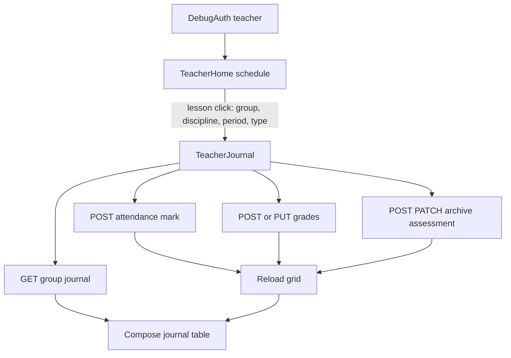

<!--firebender-plan
name: Teacher Vue Parity
overview: Привести Android teacher flow к поведению и визуальной логике Vue-фронтенда: расписание занятий и журнал с редактированием посещаемости, оценок и контрольных мероприятий. Текущая итерация будет teacher-only, но FSD/MVVM-структура останется расширяемой для будущих ролей student/methodologist/admin.
todos:
  - id: vue-parity-audit
    content: "Зафиксировать точное соответствие Vue schedule/journal data flow и Android файлов для изменения."
  - id: teacher-cleanup
    content: "Удалить или отключить неиспользуемые stub-модули и навигацию не teacher-flow."
  - id: api-models
    content: "Расширить Android API и DTO для attendance, grades, assessment forms и periods."
  - id: schedule-parity
    content: "Переписать teacher schedule под Vue week view, LessonCard и переход в журнал по lesson_type."
  - id: journal-parity
    content: "Реализовать journal table как во Vue: lecture/practice split, attendance, grades, controls, modals."
  - id: validation
    content: "Собрать проект, установить APK на телефон и пройти teacher smoke-тест."
-->

# План teacher-flow по Vue-фронтенду

## Источники истины
- Vue расписание: [C:/Users/fmkro/iis.jrnl/web.client/src/views/HomeView.vue](C:/Users/fmkro/iis.jrnl/web.client/src/views/HomeView.vue), [C:/Users/fmkro/iis.jrnl/web.client/src/components/schedule/LessonCard.vue](C:/Users/fmkro/iis.jrnl/web.client/src/components/schedule/LessonCard.vue)
- Vue журнал: [C:/Users/fmkro/iis.jrnl/web.client/src/views/JournalView.vue](C:/Users/fmkro/iis.jrnl/web.client/src/views/JournalView.vue), [C:/Users/fmkro/iis.jrnl/web.client/src/components/JournalTable.vue](C:/Users/fmkro/iis.jrnl/web.client/src/components/JournalTable.vue)
- Vue API: [C:/Users/fmkro/iis.jrnl/web.client/src/api/schedule.ts](C:/Users/fmkro/iis.jrnl/web.client/src/api/schedule.ts), [C:/Users/fmkro/iis.jrnl/web.client/src/api/journal.ts](C:/Users/fmkro/iis.jrnl/web.client/src/api/journal.ts)
- Backend contract: [C:/Users/fmkro/iis.jrnl/server/api/openapi/journal.yaml](C:/Users/fmkro/iis.jrnl/server/api/openapi/journal.yaml)
- Android current teacher flow: [C:/Users/fmkro/iis.jrnl/androind.client/features/teacher/home/src/main/java/com/journal/features/teacher/home/TeacherHomeRoute.kt](C:/Users/fmkro/iis.jrnl/androind.client/features/teacher/home/src/main/java/com/journal/features/teacher/home/TeacherHomeRoute.kt), [C:/Users/fmkro/iis.jrnl/androind.client/features/teacher/journal/src/main/java/com/journal/features/teacher/journal/TeacherJournalRoute.kt](C:/Users/fmkro/iis.jrnl/androind.client/features/teacher/journal/src/main/java/com/journal/features/teacher/journal/TeacherJournalRoute.kt)

## Целевая логика
- Расписание преподавателя повторяет Vue:
  - `GET /lessons?date_from&date_to&limit=200`
  - неделя Пн-Сб, пустые дни через empty state
  - карточка пары: номер, время, дисциплина, тип, группа, аудитория, активное занятие
  - клик передаёт `group_id`, `discipline_id`, `period_id`, `lesson_type`
- Журнал повторяет Vue:
  - `GET /groups/{groupId}/journal?discipline_id&academic_period_id`
  - если `lesson_type=lecture`: только лекции, только посещаемость, без оценок
  - если `practice/lab/seminar`: практические/лабораторные/семинары + контрольные + оценки
  - sticky-like таблица: `№`, `Студент`, занятия по месяцам, контрольные мероприятия
  - редактирование через модалки: посещаемость, оценка, добавить/редактировать/удалить контроль

## API-слой Android
- Расширить [C:/Users/fmkro/iis.jrnl/androind.client/core/network/src/main/java/com/journal/core/network/api/JournalApi.kt](C:/Users/fmkro/iis.jrnl/androind.client/core/network/src/main/java/com/journal/core/network/api/JournalApi.kt):
  - `listAcademicPeriods(include_closed)`
  - `markAttendance(lessonId, studentId, status, comment)`
  - `createGrade`, `updateGrade`
  - `createAssessmentForm`, `updateAssessmentForm`, `archiveAssessmentForm`
- Дополнить модели в [C:/Users/fmkro/iis.jrnl/androind.client/core/model/src/main/java/com/journal/core/model/teacher](C:/Users/fmkro/iis.jrnl/androind.client/core/model/src/main/java/com/journal/core/model/teacher) request/response DTO из OpenAPI.

## UI и состояние
- Переписать `TeacherHomeViewModel` под Vue week-range и `limit=200`.
- Вынести `LessonCard`-подобный Compose-компонент для расписания.
- Разделить журнал на FSD/MVVM части:
  - `TeacherJournalViewModel` — загрузка grid и операции edit/reload
  - `TeacherJournalRoute` — состояние экрана
  - таблица/ячейки/модалки — отдельные composable-компоненты
- Сохранять debug-auth совместимость: `X-Debug-Role=teacher`, base URL остаётся `http://153.80.240.154:8080/api/v1/`.

## Cleanup teacher-only
- Удалить/отключить текущие неиспользуемые stub-модули из `settings.gradle.kts` и `app/build.gradle.kts`:
  - `features/student/home`
  - `features/methodist/templates`
  - `features/admin/imports`
  - teacher-заглушки `dashboard`, `ved`, `studentcard`, если они не участвуют в Vue teacher schedule/journal flow
- Оставить архитектурную возможность вернуть роли позже через FSD-модули, но не держать пустые stubs в текущей сборке.
- Удалить неиспользуемый `OperationToScreenMatrix.kt`, если подтвердится отсутствие usages.

## Проверка
- Собрать `:app:assembleDebug`.
- Установить APK на USB-устройство через `adb install -r`.
- Smoke-тест:
  - login debug teacher
  - расписание загружает неделю
  - лекция открывает журнал лекций без оценок
  - практика открывает журнал практик с оценками/контролями
  - отметка посещаемости сохраняется и обновляет таблицу
  - оценка создаётся/обновляется
  - контроль добавляется/редактируется/архивируется

## Не входит в текущую итерацию
- Student/methodologist/admin UI — добавим позже отдельными FSD-модулями.
- Реальный Keycloak/OIDC login — пока сохраняем debug-role режим как во Vue-фронте.
